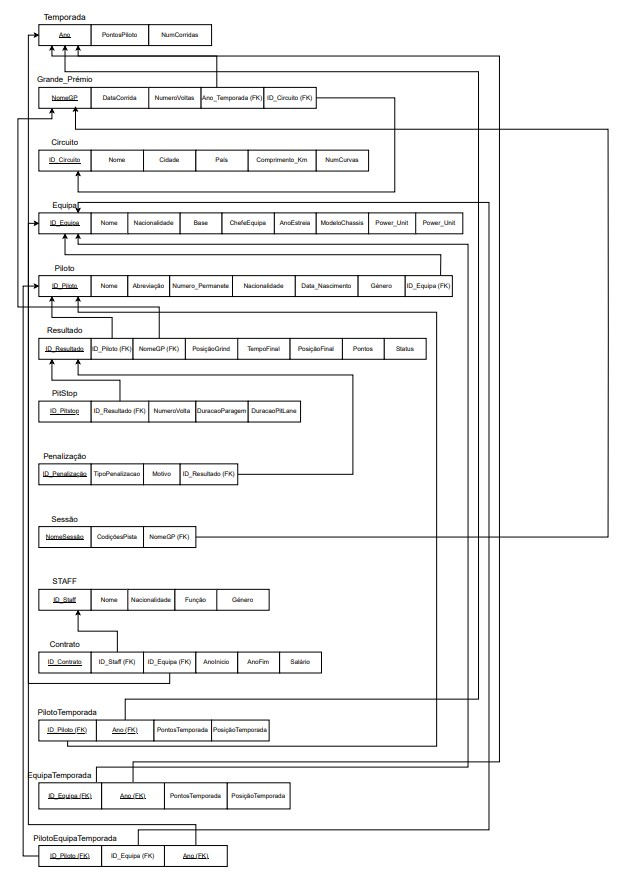
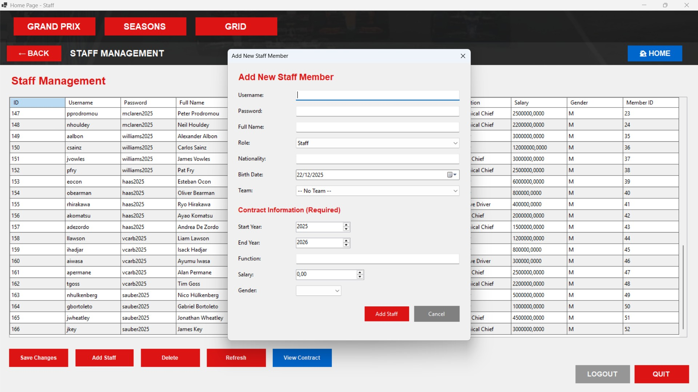

# BD: Trabalho Prático APF-T

**Grupo**: P3G9
- Maria Quinteiro, 124996
- Inês Batista, 124877

## Introdução / Introduction
 
Esta entrega documenta um projeto desenvolvido no âmbito da unidade curricular "Fundamentos de Bases de Dados". O objetivo principal do trabalho foi conceber, modelar e implementar uma base de dados relacional completa para gerir informação associada a um campeonato de corrida (modelado a partir de conceitos de Fórmula 1), cobrindo desde a modelação conceptual até à implementação física e aos scripts SQL necessários para criação, povoamento e manutenção da base de dados.

## ​Análise de Requisitos / Requirements

O Visitante deverá poder:
Visualizar a classificação atual de um determinado piloto na temporada atual;
Visualizar a classificação atual de uma determinada equipa na tenporada atual;
Visualizar tabelas de classificação de temporadas passadas de pilotos ou equipas;
Ver a lista completa de corridas passadas da temporada;
Ver os resultados detalhados de cada sessão;
Ver a grelha de partida e a classificação final de um piloto numa determinada corrida/sessão;
Ver o estado de cada sessão( ex: cancelada, adiada, etc...);
Ver os detalhes de pitstops de um piloto numa sessão;
Ver as Penalizações aplicadas a pilotos durante uma sessão;
Consultar a página de um Piloto/Equipa com a informação correspondente;
Ver a informação de um Circuito;

O Administrador de STAFF deverá poder:
Adicionar, editar/atualizar ou remover temporadas, circuitos, pilotos, equipas;
Adicionar novos membros ao STAFF;
Gerir os Contratos do pessoal, associando um STAFF a uma Equipa com um salário e duração;
Criar as Corridas/Sessões para uma temporada, associando-as a um Circuito;
Registar dados Pós-Corrida/Sessão;
Registar Penalizações dadas a um piloto durante uma sessão;
Atualizar Classificações;

## DER - Diagrama Entidade Relacionamento/Entity Relationship Diagram

### Versão final/Final version


### Melhorias/Improvements 

Foi adicionada uma nova entidade, o Staff, uma vez que existe pessoal não associado a qualquer equipa, algo impossível no diagrama anteriormente entregue. 
Foi eliminado o atributo NumeroVoltas da entidade Grande_Prémio já que não faz muito sentido um evento de um fim de semana inteiro ter número de voltas. Poderia ser adicionado futuramente o número de voltas da Race ou Sprint Racemas considerámos não ser essencial para o desenvolvimento da nossa base de dados.
Muitas das entidades passaram a ser fracas já que chegamos à conclusão de que dependiam de outras totalmente. 


## ER - Esquema Relacional/Relational Schema

### Versão final/Final Version



### Melhorias/Improvements

Os atributos dependentes do par (Piloto, Temporada) foram transferidos para uma nova entidade, PilotoTemporada, que regista o ID_Piloto, o Ano (ambos formando a chave primária e, simultaneamente, chaves estrangeiras para as tabelas Piloto e Temporada), PontosTemporada e PosiçãoTemporada. Esta modelação assegura que a dependência funcional (ID_Piloto, Ano) → PontosTemporada, PosiçãoTemporada é válida e que a relação está na BCNF. Seguindo a mesma lógica, foi criada a tabela EquipaTemporada com a estrutura análoga (ID_Equipa, Ano, PontosTemporada, PosiçãoTemporada), resolvendo a dependência dos pontos e posição da equipa em relação à temporada

## ​SQL DDL - Data Definition Language

[SQL DDL File](sql/01_ddl.sql "SQLFileQuestion")

## SQL DML - Data Manipulation Language

```sql
INSERT INTO Circuito (Nome, Cidade, Pais, Comprimento_km, NumCurvas)
VALUES 
('Albert Park Circuit', 'Melbourne', 'Australia', 5.278, 16),

INSERT INTO Temporada (Ano, NumCorridas)
VALUES (2024, 0);

INSERT INTO Equipa (Nome, Nacionalidade, Base, ChefeEquipa, ChefeTécnico, AnoEstreia, ModeloChassis, Power_Unit)
VALUES 
('Alpine', 'French', 'Enstone, United Kingdom', 'Flavio Briatore', 'David Sanchez', '1986', 'A525', 'Renault'),

INSERT INTO Membros_da_Equipa (Nome, Nacionalidade, DataNascimento, Género, Função, ID_Equipa)
VALUES
('Pierre Gasly', 'French', '1996-02-07', 'M', 'Driver', 1),

INSERT INTO Contrato (AnoInicio, AnoFim, Função, Salário, Género, ID_Membro)
VALUES
(2023, 2026, 'Driver', 8000000.00, 'M', (SELECT ID_Membro FROM Membros_da_Equipa WHERE Nome = 'Pierre Gasly' AND ID_Equipa = 1)),

INSERT INTO Piloto (NumeroPermanente, Abreviação, ID_Equipa, ID_Membro)
VALUES
(10, 'GAS', 1, (SELECT ID_Membro FROM Membros_da_Equipa WHERE Nome = 'Pierre Gasly')),

INSERT INTO Grande_Prémio (NomeGP, DataCorrida, ID_Circuito, Ano_Temporada)
VALUES 
('Australian Grand Prix 2024', '2024-03-24', (SELECT ID_Circuito FROM Circuito WHERE Nome = 'Albert Park Circuit'), 2024),

INSERT INTO Sessões (NomeSessão, NomeGP, Estado, CondiçõesPista)
VALUES
('Free Practice 1', 'Australian Grand Prix 2025', 'Completed', 'Dry'),

INSERT INTO Resultados (NomeSessão, NomeGP, ID_Piloto, PosiçãoGrid, TempoFinal, PosiçãoFinal, Pontos, Status)
VALUES
('Qualifying', 'Australian Grand Prix 2025', (SELECT ID_Piloto FROM Piloto WHERE NumeroPermanente = 44), 0, '00:01:15.915', 1, 0, 'Completed'),

INSERT INTO Pitstop (NumeroVolta, DuraçãoParagem, DuraçãoPitlane, NomeSessão, NomeGP, ID_Piloto)
VALUES
(15, '00:00:02.234', '00:00:21.456', 'Race', 'Australian Grand Prix 2025', (SELECT ID_Piloto FROM Piloto WHERE NumeroPermanente = 44)),

INSERT INTO Penalizações (TipoPenalização, Motivo, NomeSessão, NomeGP, ID_Piloto)
VALUES
('Warning', 'Exceeding track limits multiple times (Turns 9 and 10)', 'Qualifying', 'Australian Grand Prix 2025', (SELECT ID_Piloto FROM Piloto WHERE NumeroPermanente = 22)),

INSERT INTO Staff (Username, Password, NomeCompleto)
VALUES
('pgasly', 'alpine2025', 'Pierre Gasly'),

```


### Formulario exemplo/Example Form



```sql
-- Show data on the form
SELECT * FROM vw_Staff_Details ORDER BY StaffID;

-- Insert new element
   INSERT INTO Staff (Username, Password, NomeCompleto)
    VALUES (@Username, @Password, @NomeCompleto);
```

...

## Normalização/Normalization

Para cumprir BCNF, reconfiguramos Temporada para conter apenas Ano (PK) e NumCorridas garantindo Ano → NumCorridas. Atributos dependentes de (Piloto,Ano) foram movidos para PilotoTemporada (ID_Piloto, Ano PKs/FKs, PontosTemporada, PosiçãoTemporada). De forma análoga foi criada EquipaTemporada (ID_Equipa, Ano, PontosTemporada, PosiçãoTemporada). Removemos PontosTemporada e PosiçãoTemporada de Piloto e Equipa, pois são propriedades da época, não das entidades. 

## Índices/Indexes

[SQL Indexes](sql/07_indexes.sql "SQLFileQuestion")
```sql
CREATE NONCLUSTERED INDEX IX_Resultados_Session ON Resultados(NomeSessão) INCLUDE (Pontos, PosiçãoFinal);
GO
```

## SQL Programming: Stored Procedures, Triggers, UDF

[SQL SPs and Functions File](sql/02_sp_functions.sql "SQLFileQuestion")

[SQL Triggers File](sql/03_triggers.sql "SQLFileQuestion")

## Outras notas/Other notes

### Dados iniciais da dabase de dados/Database init data

[SQL DB Init File](sql/04_db_init.sql "SQLFileQuestion")

### Apresentação

[Slides](slides.pdf "Sildes")

[Video](Demo.mp4)


 